<div align="center">

# 🧭 Voyantra — AI Travel Planner

### Multi-City Itinerary Intelligence — Grounded in Real Places, Weather & Routing

[](https://python.org)
[](https://fastapi.tiangolo.com)
[](#-how-the-agentic-rag-pipeline-works)
[](https://openai.com)
[](https://qdrant.tech)
[](https://docs.celeryq.dev)
[](https://postgresql.org)
[](#-security)
[](https://nextjs.org)
[](#-observability)
[](https://docker.com)
[](#-deployment)
[](#-deployment)

[🚀 Quick Start](#-quick-start) · [✨ Features](#-features) · [🏗️ Architecture](#-architecture) · [📡 API](#-api-reference) · [🐳 Deployment](#-deployment)

</div>

---

## 📌 What Is This?

**Voyantra** is a full-stack, production-grade **Agentic RAG** travel planner. You give it one to five cities, your interests, and a trip length — and a **multi-agent system** plans each city *in parallel*, grounds every recommendation in **real places** (a curated POI corpus + live geocoding / weather / routing), sequences a feasible day-by-day plan, computes inter-city travel legs, and a **critic agent** verifies the draft for invented places and infeasible timing before it ships. You watch the whole thing happen **live** as it streams, and see the result on a map.

---

## ✨ Features

| Feature | Description |
|---|---|
| 🧠 **Multi-Agent Planner** | A coordinator fans out one **worker agent per city** (parallel) + a **critic agent** that catches invented places and re-plans (capped corrective loop) |
| 🗺️ **Real-Place Grounding** | Itineraries are grounded in a curated POI corpus (Qdrant RAG) + live geocoding / POI / weather / routing — it **refuses to invent** when it can't ground |
| 🌍 **Multi-City Trips** | 1–5 cities, up to 10 days (real day count is bounded by grounded POIs), **parallel fan-out**, inter-city travel legs, and **partial results** (one city fails → the rest still ship) |
| ⚡ **Async + Resumable** | `POST` returns a `run_id` instantly; the worker runs the graph; a crashed worker **resumes from the last completed node** (LangGraph Postgres/SQLite checkpointer) |
| 📡 **Live Trace Streaming** | Server-Sent Events stream each agent step (geocode → gather → compose → critic) to the browser in real time |
| 🔀 **Tiered LLM Gateway** | `gpt-4o-mini` (cheap) → `gpt-4o` (mid/frontier) by step, with **cross-provider fallback** (OpenAI → Anthropic → Groq, key-gated) for outage resilience |
| 💰 **Cost-Bounded** | Per-run **and per-sub-agent** hard caps + a global kill switch + a budget eval gate — measured **~$0.0015 / itinerary** on the golden set (≤ $0.30 ceiling) |
| 🔐 **Enterprise Security** | Native sign-up (scrypt) / Google / Auth0 (fail-closed) · per-tenant run isolation · **ACL enforced inside Qdrant** · PII log redaction · prompt-injection guard · rate limiting · right-to-be-forgotten |
| 📈 **Full Observability** | One run = one OpenTelemetry trace (api → worker → agent → llm) · Langfuse generations · Prometheus RED + cost metrics · Grafana · Loki logs · Alertmanager — **no prompt text ever logged** |
| 🐳 **Deploy-Ready** | Multi-stage non-root Docker · 3-layer compose mesh · Helm chart (kind → EKS) · Terraform (EKS / RDS / ElastiCache / ECR / IRSA) · ArgoCD GitOps · CI + an **eval-gated** promote workflow |

---

## 🖼️ Screenshots

<div align="center">

### Home
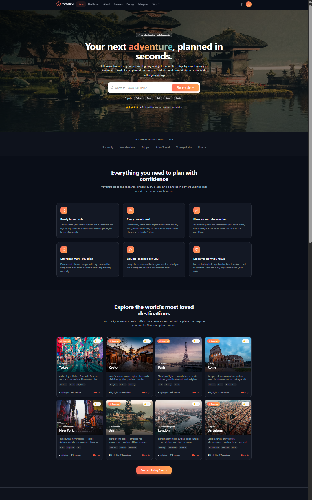

### Dashboard
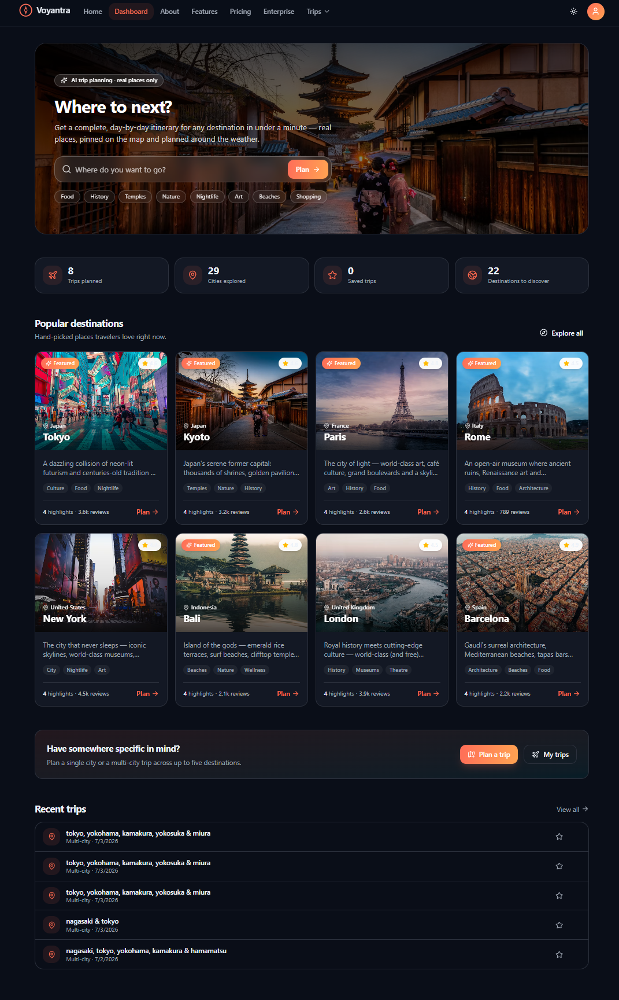

### Features
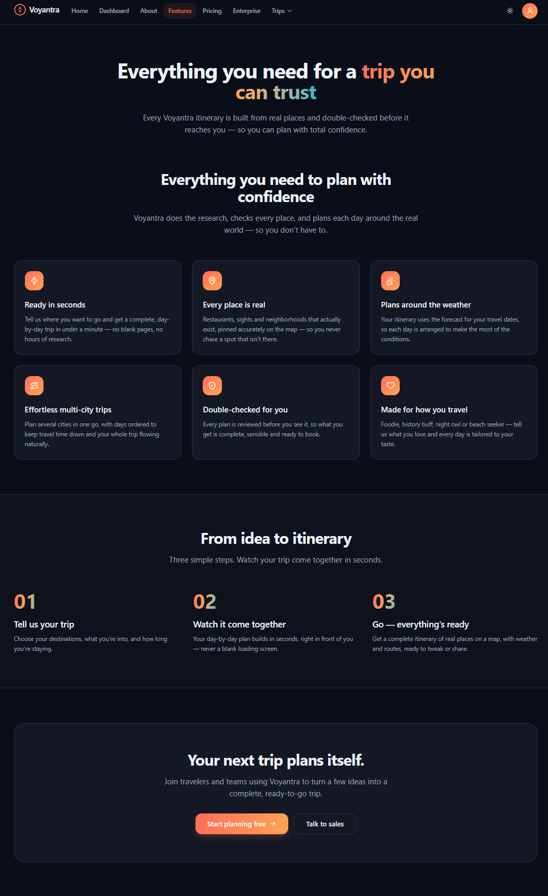

### Grounded Itinerary on the Map (MapLibre)
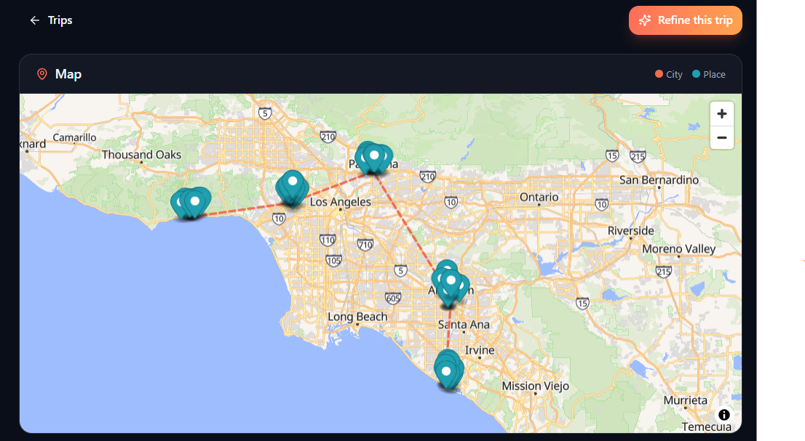

### Plan a Trip — live agent trace, streaming, and result
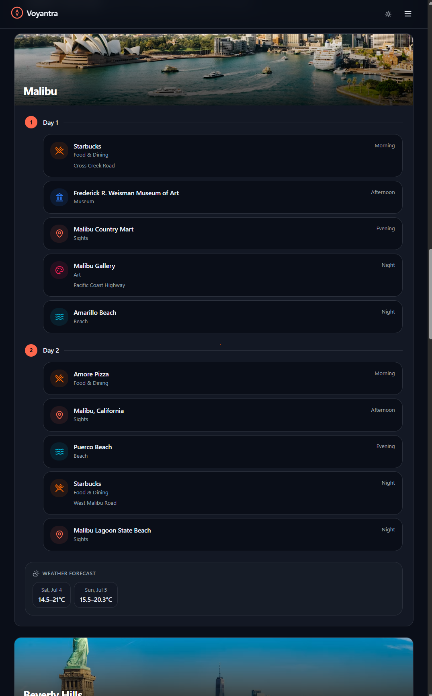
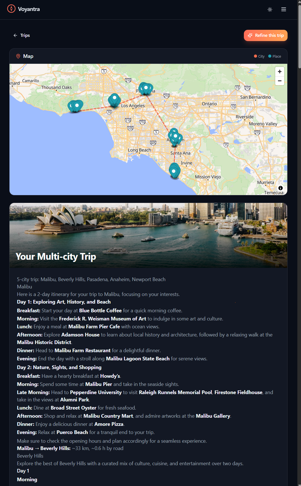
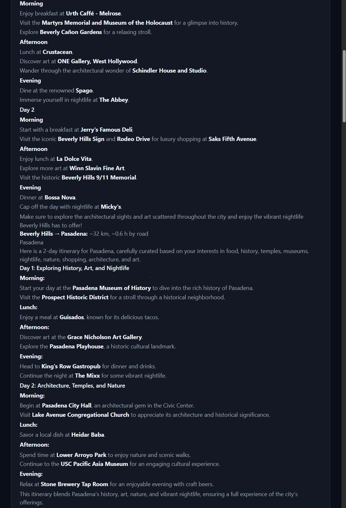
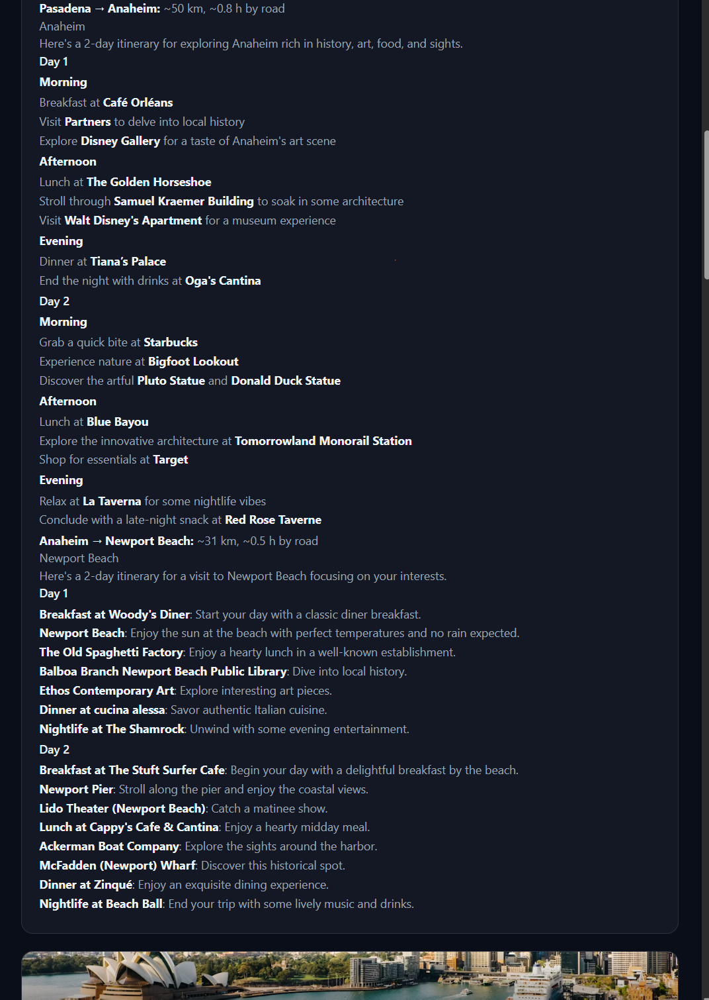
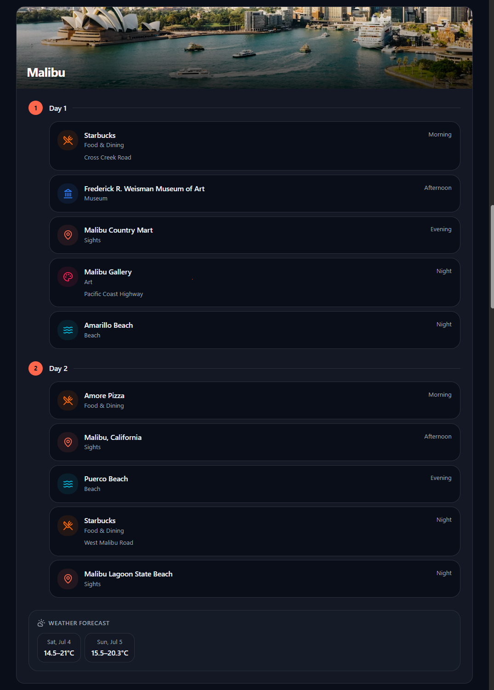
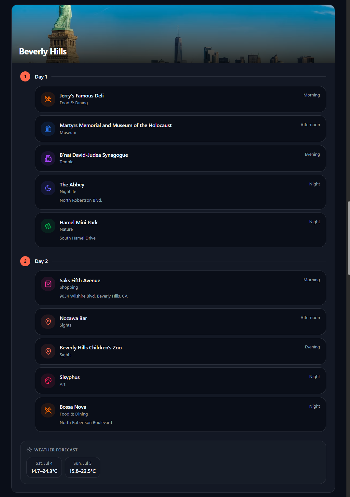

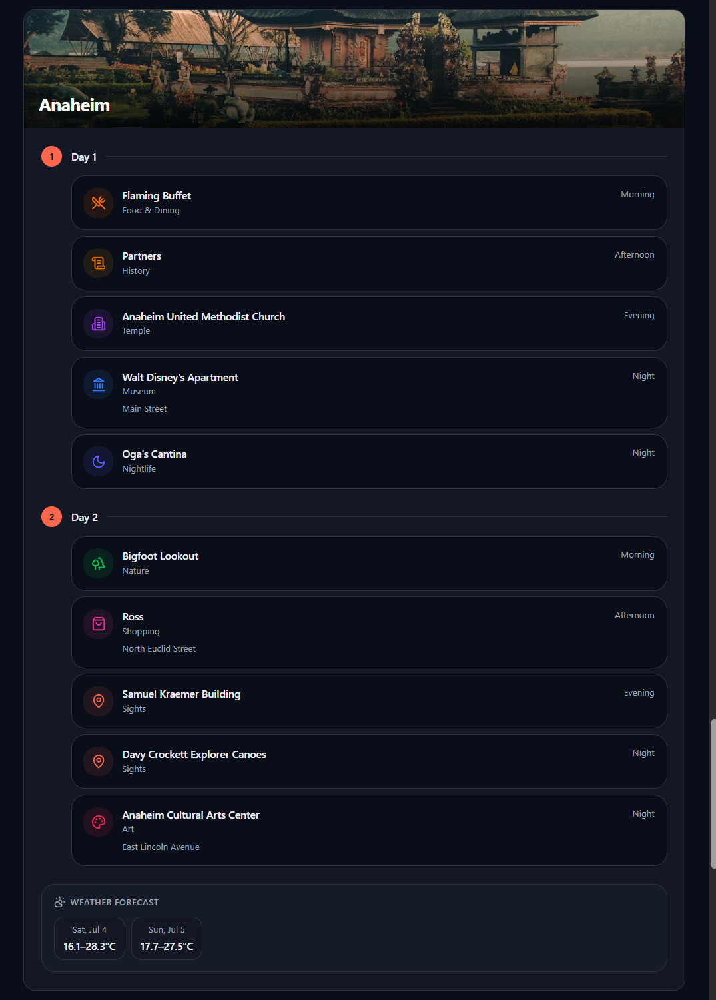
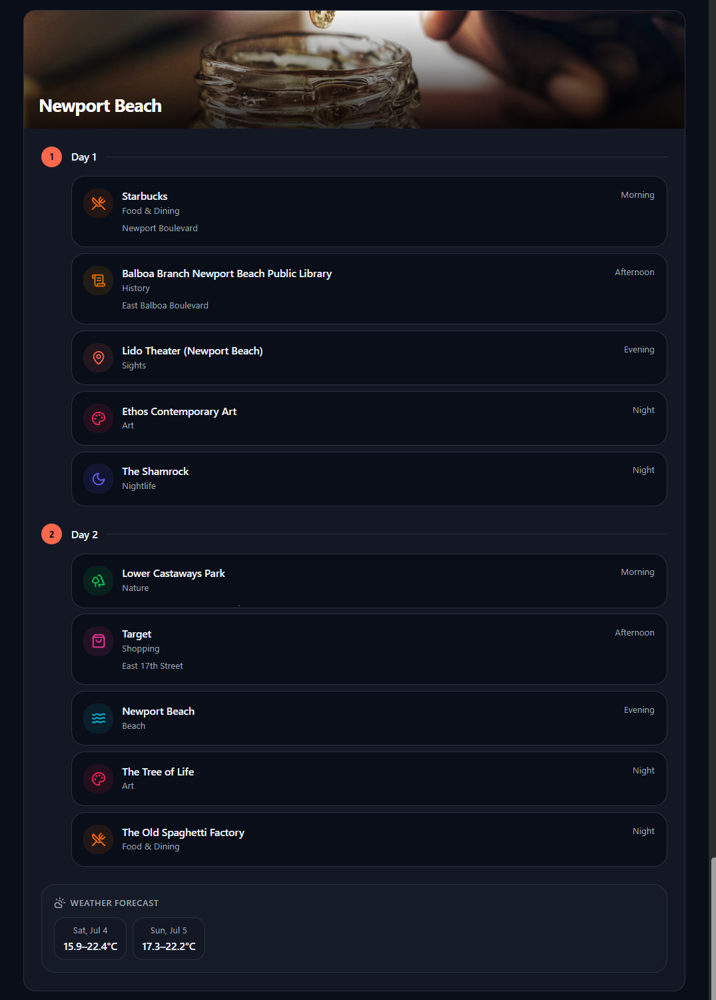
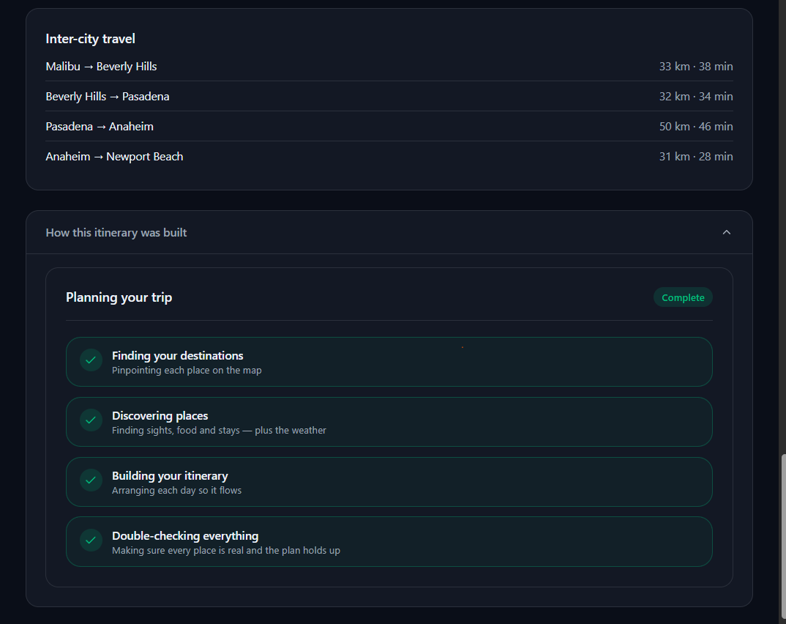

</div>


## 🏗️ Architecture

```
┌──────────────────────────────────────────────────────────────────┐
│             CLIENT  ·  Next.js 15 / React 19 / Tailwind          │
│        Marketing site · Product app · Live trace · MapLibre      │
│   same-origin BFF route handlers attach the session/token server-│
│   side  →  the access token never reaches the browser            │
│   Auth: native sign-up (scrypt) · optional Google OAuth · Auth0  │
└─────────────────────────┬────────────────────────────────────────┘
                          │  REST + SSE (EventSource)
┌─────────────────────────▼────────────────────────────────────────┐
│                  FastAPI  Backend  (async)                       │
│  POST /plan  POST /trip → persist Run + enqueue → 202 {run_id}   │
│  GET /runs/{id}   GET /runs/{id}/stream (SSE)   /health /metrics │
│  Auth gate (fail-closed outside local) · rate-limit · kill switch│
└──────┬───────────────────┬─────────────────────┬─────────────────┘
       │                   │                     │
┌──────▼──────┐   ┌────────▼────────┐   ┌────────▼─────────┐
│  Postgres   │   │  Celery + Redis │   │   Redis caches   │
│  run state  │   │   broker/queue  │   │ geo/POI/weather/ │
│  + audit    │   └────────┬────────┘   │ route (per-TTL)  │
│ (tenant-    │            │            └──────────────────┘
│  scoped)    │   ┌────────▼─────────────────────────────────┐
└─────────────┘   │   WORKER · LangGraph multi-agent         │
                  │   coordinator                            │
┌─────────────┐   │    └─ per-city worker  (parallel)        │
│   Qdrant    │◄──┤        geocode → gather → compose        │
│  POI vectors│   │        (corpus RAG + live tools)         │
│ 1024-d, ACL │   │    → critic → corrective loop            │
└─────────────┘   │    → merge + inter-city legs             │
                  └────────┬─────────────────────────────────┘
┌─────────────────────────▼─────────────────────────────────┐
│   LLM gateway · tier gpt-4o-mini→gpt-4o · fallback         │
│   OpenAI → Anthropic → Groq (key-gated) · per-call cost    │
└───────────────────────────────────────────────────────────┘
  Observability: OpenTelemetry → Jaeger · Langfuse · Prometheus → Grafana · Loki
  Durability:    LangGraph Postgres/SQLite checkpointer (resume-after-crash)
```

### Request Flow

```
[Traveler]
   │  sign in (native / Google / Auth0) → enter cities + interests + days
   ▼
POST /plan|/trip ──► persist Run (tenant-scoped) ──► enqueue Celery task ──► 202 {run_id}
   │
   ├──► GET  /runs/{id}          ──►  status: queued | running | succeeded | failed (+ result)
   └──► GET  /runs/{id}/stream   ──►  SSE: geocode → gather → compose → critic → done
                                       │
        WORKER (LangGraph)  ──────────►  per-city: geocode → retrieve real POIs (Qdrant + live tools)
                                          → weather → compose day plan → CRITIC checks grounding
                                          → (revise if needed) → merge cities + inter-city legs
                                          → record status / result / cost on the Run
```

---

## 🗂️ Project Structure

```
voyantra/                                # uv monorepo (workspace)
├── packages/
│   ├── core/      tp_core               # config · JSON logging · exceptions · LLM gateway · cache
│   │                                    # cost-cap/kill-switch · auth · tracing · metrics · guard · ratelimit
│   │                                    # db · runs (run store) · events (SSE) · celery app
│   ├── tools/     tp_tools              # geocode / POI / weather / routing  (keyless OSS + resilient HTTP)
│   ├── agents/    tp_agents             # LangGraph multi-agent graph · coordinator · critic · checkpointer
│   ├── retrieval/ tp_retrieval          # embeddings · Qdrant store (tenant ACL) · retrieve · ingest
│   └── eval/      tp_eval               # golden set · metrics · LLM-judge · eval GATE
├── apps/
│   ├── api/       tp_api                # FastAPI: async dispatch · SSE · auth · /metrics · RTBF
│   ├── worker/    tp_worker             # Celery worker that runs the planner graph
│   └── web/       voyantra-web          # Next.js 15 · BFF · live trace · MapLibre · native+Google+Auth0 auth
├── infra/
│   ├── helm/voyantra/                   # Helm chart (kind & EKS; managed-DB toggles; dev/staging/prod values)
│   ├── kind/                            # local kind cluster config
│   ├── terraform/                       # EKS · RDS · ElastiCache · ECR · IRSA · VPC
│   ├── argocd/                          # AppProject + dev/staging/prod Applications
│   └── observability/                   # prometheus.yml · alerts.yaml · alertmanager.yml · promtail.yml · grafana-*
├── data/corpus/pois.jsonl               # seed POI corpus — 25 POIs across 5 cities (ingested into Qdrant)
├── tests/load/plan_smoke.js             # k6 load test (ramps to 50 concurrent)
├── scripts/                             # kind-up.sh · kind-down.sh · backup_restore_drill.sh
├── .github/workflows/                   # ci.yml (green gate + audits) · cd.yml (build/push → ECR) · promote.yml (eval gate)
├── docker-compose.data.yml              # layer 1 — Postgres · Redis · Qdrant · Overpass (OSM POI)
├── docker-compose.app.yml               # layer 2 — api · worker · web
├── docker-compose.observability.yml     # layer 3 — Jaeger · Prometheus · Grafana · Loki · Alertmanager · Flower · RedisInsight · Langfuse
├── pyproject.toml · uv.lock · .env.example · conftest.py
└── Makefile                             # every workflow is a `make <target>`
```


## ⚙️ Tech Stack

| Layer | Technology |
|---|---|
| **Agents** | LangGraph (coordinator + per-city worker + critic, corrective loop) |
| **LLM** | OpenAI `gpt-4o-mini` (cheap) / `gpt-4o` (mid + frontier) via a tiered gateway; fallback OpenAI → Anthropic → Groq (self-pruning by which keys are set) |
| **Embeddings** | OpenAI `text-embedding-3-large` @ **1024-d** (Voyage `voyage-3` optional, same dim) |
| **Vector RAG** | Qdrant (server or embedded), cosine + payload filters + **per-tenant ACL** |
| **Tools** | Keyless OSS — Nominatim (geocode) · Overpass / Wikipedia GeoSearch (POI) · Open-Meteo (weather) · OSRM (routing) |
| **Backend** | Python 3.13 · FastAPI (async) · Pydantic v2 · uv workspace |
| **Async** | Celery + Redis broker · Postgres run-state · LangGraph Postgres/SQLite checkpointer · SSE (Redis pub/sub) |
| **Caching / Cost** | Redis per-tool TTL caches · per-run + per-sub-agent caps · kill switch |
| **Observability** | OpenTelemetry → Jaeger · Langfuse (self-hosted) · Prometheus (RED + cost) → Grafana · Loki + Promtail (logs) · Alertmanager · Flower · RedisInsight · structured JSON logs |
| **Security** | Native session auth (scrypt + `jose` HS256 httpOnly cookie) · optional Google OAuth / Auth0 (RS256 JWT) · tenant ACL · PII redaction · injection guard · rate limiting |
| **Frontend** | Next.js 15 · React 19 · TypeScript · Tailwind v4 · MapLibre (OpenFreeMap) |
| **Eval** | Custom golden-set metrics + LLM-judge (RAGAS optional) · **gates promotion to staging/prod** |
| **Deployment** | Docker (multi-stage, non-root) · Helm · Kubernetes (kind → EKS) · Terraform · ArgoCD · GitHub Actions |

---

## 🚀 Quick Start

> Everything is driven by a **`Makefile`** — run `make <target>`. The full command reference is in [§ Make command reference](#-make-command-reference) below; the fastest path from a clean clone is a single **`make upv`**.

### Prerequisites
- **Python 3.13** (pinned in `.python-version`) and [`uv`](https://docs.astral.sh/uv/)
- **Docker + Docker Compose** (for the full stack) · **Node 22 + pnpm** (for native web dev; the Docker path builds it)
- An **OpenAI API key** — the only required secret (the app fails fast at startup without it)

### 1 · Install & configure

```bash
git clone <your-repo-url> voyantra && cd voyantra
uv sync                        # create the venv + install every workspace package
cp .env.example .env           # then set OPENAI_API_KEY (everything else has a safe default)
```

### 2 · Quality gate

```bash
uv run pytest                  # all backend tests (128)
uv run ruff check .            # lint
# strict mypy + security audits (bandit / pip-audit / detect-secrets / licenses) run in CI — see .github/workflows/ci.yml
```

### 3 · Build the grounding index + score quality

```bash
uv run python -m tp_retrieval.ingest      # embed data/corpus/pois.jsonl → Qdrant (embedded by default)
uv run python -m tp_eval --retrieve       # score the planner through retrieval → baselines/
```
> Embeddings use OpenAI unless `VOYAGE_API_KEY` is set. **Ingest and eval must use the same embedder** — if seeded with OpenAI, don't switch to Voyage for queries (the vector spaces differ and RAG silently returns nothing).

### 4 · Run the full stack — **Docker (recommended)**

From a clean clone, **one command** does everything — build images, start every tier, create the
database schema, and ingest the grounding corpus:

```bash
make upv             # from scratch: wipe → rebuild → migrate → seed → dashboards, then print URLs
```

Then open **http://localhost:3006** (dev login: `voyantra`). `make urls` prints every UI link.

#### 🔧 Make command reference

Run `make <target>`. All ports and credentials live in `.env` (each has a safe default).

**Set up & run**

| Command | What it does |
|---|---|
| **`make upv`** | **From scratch, one command** — wipe app data, rebuild & start every tier (data + app + dashboards), create the schema, and ingest the corpus. The clean-slate command. Keeps the Overpass OSM import. |
| `make bootstrap` | App tier only, non-destructive — start data + app, create the schema, seed the corpus. |
| `make full` | All Docker tiers together: data + app + observability. |
| `make up` | Everything **plus** the local Kubernetes cluster + Helm deploy. |
| `make data` | Data stores only — Postgres, Redis, Qdrant, Overpass. |
| `make app` | Data + application — API, worker, web. |
| `make observability` | Dashboards only — Jaeger, Prometheus, Grafana, Loki, Alertmanager, Flower, RedisInsight, Langfuse. |

**Database & corpus**

| Command | What it does |
|---|---|
| `make migrate` | Create/upgrade the Postgres schema (idempotent). |
| `make seed` | Ingest the POI corpus into the running Qdrant server. |
| `make ingest` | Ingest into a local/embedded Qdrant (native dev). |

**Inspect**

| Command | What it does |
|---|---|
| `make urls` | Print every UI URL (ports read from `.env`). |
| `make ps` | Status of every container. |
| `make logs` | Tail logs for the whole stack. |

**Stop & erase**

| Command | What it does |
|---|---|
| `make down` | Stop the stack (keeps data volumes) and delete the kind cluster. |
| `make downv` | Stop **and wipe** app/data volumes — keeps the Overpass OSM import. |
| `make downv-overpass` | Also wipe the Overpass OSM database (forces a multi-hour re-import). |
| `make infra-down` | Delete the local kind cluster only. |

**Quality & checks**

| Command | What it does |
|---|---|
| `make check` | Lint + strict types + tests — the green gate. |
| `make test` · `make lint` · `make typecheck` | Run each individually. |
| `make audit` | Security & supply-chain audit (bandit · pip-audit · licenses). |
| `make chaos` · `make load` | Resilience/chaos tests · k6 load test. |
| `make eval` · `make eval-rag` | Score the planner (on fixtures · through real retrieval). |

**Native dev** (host, against `make data`)

| Command | What it does |
|---|---|
| `make install` | `uv sync` — install the workspace. |
| `make api` · `make worker` | Run the API (with reload) / a Celery worker on the host. |

Under the hood, the `make` targets are thin wrappers over the three compose layers, which you can also run directly with `-f`:

```bash
# Layer 1 — data stores only (Postgres · Redis · Qdrant · Overpass)
docker compose -f docker-compose.data.yml up -d

# Layers 1+2 — data + app (api + worker + web)   ← the usual "run the product"
docker compose -f docker-compose.data.yml -f docker-compose.app.yml up --build

# Layers 1+2+3 — add the full observability stack
docker compose \
  -f docker-compose.data.yml \
  -f docker-compose.app.yml \
  -f docker-compose.observability.yml up --build
```

> **First-boot note:** the data tier includes a **self-hosted Overpass** (OpenStreetMap) POI service. Its first start imports a regional OSM extract — **~2–4 h into a ~40–60 GB database** — and stays idle until the import finishes (`docker compose logs -f overpass`). The rest of the stack runs fine meanwhile; the curated Qdrant corpus grounds the hero cities, and Wikipedia GeoSearch is the fallback until Overpass is ready.

**Service map** (host ports from `.env.example`):

| Service | URL / Port | Tier |
|---|---|---|
| 🌐 **Web** (marketing + product) | http://localhost:3006 | app |
| 📡 **API** | http://localhost:3004 · docs at http://localhost:3004/docs | app |
| 📟 Worker metrics (Prometheus exporter) | `localhost:3005/metrics` | app |
| 🐘 Postgres | `localhost:3001` | data |
| 🧱 Redis | `localhost:3002` | data |
| 🔎 Qdrant | http://localhost:3003/dashboard | data |
| 🗺️ Overpass (self-hosted OSM POI) | http://localhost:3015 | data |
| 🕸️ Jaeger (traces) | http://localhost:3007 · OTLP HTTP ingest on `:3008` | obs |
| 📊 Prometheus | http://localhost:3009 | obs |
| 📈 Grafana | http://localhost:3010 | obs |
| 🔔 Alertmanager | http://localhost:3018 | obs |
| 🪵 Loki (logs) | `localhost:3017` (queried via Grafana) | obs |
| 🌼 Flower (Celery) | http://localhost:3011 | obs |
| 🧰 RedisInsight | http://localhost:3012 | obs |
| 🔭 Langfuse (LLM traces) | http://localhost:3013 · MinIO console `:3014` · Postgres `:3016` | obs |

### 4 (alternate) · Run natively — **fast dev loop**

Celery needs Redis, so start the data tier (or at least Redis + Qdrant), then run each process with `uv` / `pnpm`:

```bash
docker compose -f docker-compose.data.yml up -d          # Postgres + Redis + Qdrant (+ Overpass)

# shell 1 — worker (Windows auto-uses the 'solo' pool; Linux uses prefork)
uv run celery -A tp_worker.celery_app worker -l info

# shell 2 — API (native default port 8000)
uv run uvicorn tp_api.main:app --port 8000

# shell 3 — web (native default port 3000)
cd apps/web && pnpm install && pnpm dev
```

### 5 · Smoke test

```bash
curl localhost:3004/health          # (Docker) — use :8000 if running the API natively
RID=$(curl -s -X POST localhost:3004/plan -H "content-type: application/json" \
  -d '{"city":"Kyoto","interests":["temples","food"],"days":1}' | jq -r .run_id)
curl -s  localhost:3004/runs/$RID           # status + grounded itinerary
curl -N  localhost:3004/runs/$RID/stream    # live SSE trace

# multi-city
curl -s -X POST localhost:3004/trip -H "content-type: application/json" \
  -d '{"cities":["Paris","Rome"],"interests":["history","food"],"days":4}'
```
> With `AUTH_ENABLED=false` (the local default) no token is needed. In the browser, open **http://localhost:3006** → sign up (name / email / password, or "Continue with Google" if configured) → plan a trip → watch the live trace + map.

---

## 🔑 Environment Variables

Copy `.env.example` → `.env`. **Only `OPENAI_API_KEY` is required.** Host ports default to a `3001–3018` scheme so the whole stack fits on one machine. (Full annotated list lives in `.env.example`.)

```env
# ── App ─────────────────────────────────────────────
APP_ENV=local                 # local | dev | staging | prod
LOG_LEVEL=INFO

# ── LLM providers (OpenAI primary; others optional fallback rungs) ──
OPENAI_API_KEY=               # REQUIRED — app fails fast if missing
ANTHROPIC_API_KEY=            # optional fallback rung; also unlocks the frontier tier (claude-opus-4-8)
GROQ_API_KEY=                 # optional fallback (inert if empty)
VOYAGE_API_KEY=               # optional embeddings (voyage-3, 1024-d); empty → OpenAI embeddings

# ── Data tier (host ports; containers stay on 5432/6379/6333 internally) ──
POSTGRES_USER=tp
POSTGRES_PASSWORD=tp
POSTGRES_DB=tp
POSTGRES_PORT=3001
DATABASE_URL=postgresql+asyncpg://tp:tp@localhost:3001/tp   # omit → sqlite (zero-Docker)
REDIS_PORT=3002
REDIS_URL=redis://localhost:3002/0
QDRANT_URL=                   # empty → embedded; compose sets http://qdrant:6333
QDRANT_PORT=3003
OVERPASS_PORT=3015            # self-hosted OSM POI tier
OSM_DATA_DIR=./osm-data       # holds the pre-downloaded .osm.pbf extract
OVERPASS_PLANET_FILE=us-latest.osm.pbf   # first boot imports this (~2–4h, ~40–60GB DB)

# ── Cost controls ───────────────────────────────────
MAX_COST_USD=0.30             # per-itinerary cap + budget eval gate

# ── Auth (native by default; fill Auth0/Google to enable them) ──
AUTH_ENABLED=false            # backend gate: false → open web sessions (enforced unless local when unset)
APP_BASE_URL=http://localhost:3006
RATE_LIMIT_PER_MIN=60
AUTH0_DOMAIN=                 # optional — Auth0 hosted login (RS256 JWT verified by the API)
AUTH0_AUDIENCE=
AUTH0_CLIENT_ID=
AUTH0_CLIENT_SECRET=
AUTH0_SECRET=
GOOGLE_CLIENT_ID=             # optional — "Continue with Google" button
GOOGLE_CLIENT_SECRET=

# ── Web app ─────────────────────────────────────────
API_PORT=3004
WEB_PORT=3006
WORKER_METRICS_PORT=3005      # worker Prometheus exporter (host port)
DEV_LOGIN_PASSWORD=voyantra
SESSION_SECRET=change-me-to-a-32-byte-random-string

# ── Observability dashboards (host ports) ──
JAEGER_UI_PORT=3007
OTLP_HTTP_PORT=3008           # Jaeger's OTLP HTTP receiver
PROMETHEUS_PORT=3009
GRAFANA_PORT=3010
FLOWER_PORT=3011
REDISINSIGHT_PORT=3012
LANGFUSE_PORT=3013
MINIO_CONSOLE_PORT=3014       # Langfuse's object store console
LANGFUSE_POSTGRES_PORT=3016
LOKI_PORT=3017
ALERTMANAGER_PORT=3018
LANGFUSE_PUBLIC_KEY=          # set (with the secret) to send spans to Langfuse
LANGFUSE_SECRET_KEY=
OTEL_EXPORTER_OTLP_ENDPOINT=  # spans export only when set (compose sets it in-network)
```

---

## 📡 API Reference

| Method | Endpoint | Auth | Description |
|---|---|---|---|
| `GET` | `/health` | – | Service status |
| `GET` | `/metrics` | – | Prometheus RED + cost metrics |
| `POST` | `/plan` | ✓* | Plan a single city → `202 {run_id}` (async) |
| `POST` | `/trip` | ✓* | Plan a multi-city trip (1–5 cities) → `202 {run_id}` |
| `GET` | `/runs/{id}` | ✓* | Run status + grounded result (tenant-scoped) |
| `GET` | `/runs/{id}/stream` | ✓* | **SSE** live agent trace → terminal |
| `DELETE` | `/me/data` | ✓ | Right-to-be-forgotten (token-scoped tenant purge) |

<sub>*Auth is **fail-closed** outside `local`. With `AUTH_ENABLED=false` (default) these are open for DX; when enabled they require a valid session/JWT. `/health` + `/metrics` always stay open for probes/scrape.</sub>

### Example: Plan a city

```json
POST /plan
{ "city": "Kyoto", "interests": ["temples", "food"], "days": 1 }
```
```json
// 202 Accepted
{ "run_id": "0c4f…", "status": "queued" }
```
```json
// GET /runs/{id}  → on success (result is the grounded Itinerary)
{
  "id": "0c4f…",
  "kind": "plan",
  "status": "succeeded",
  "cost_usd": 0.0017,
  "result": {
    "city": "Kyoto",
    "grounded": true,
    "summary_markdown": "A 1-day plan for Kyoto focused on temples, food…",
    "days": [
      { "day": 1, "items": [
        { "name": "Fushimi Inari Taisha", "category": "temple",
          "latitude": 34.9671, "longitude": 135.7727, "note": "68 Fukakusa Yabunouchichō" }
      ]}
    ],
    "pois_used": [
      { "name": "Fushimi Inari Taisha", "category": "temple", "latitude": 34.9671, "longitude": 135.7727 }
    ],
    "warnings": [],
    "corrections": 0,
    "cost_usd": 0.0017
  }
}
```

---

## 🧠 How the Agentic RAG Pipeline Works

1. **Dispatch** — `POST /plan`|`/trip` persists a `Run` (tenant-scoped), enqueues a Celery task, and returns a `run_id` in `202` — the API never blocks on the LLM.
2. **Coordinate** — the worker's LangGraph **coordinator** fans out one **worker agent per city** in parallel (`asyncio.gather`), isolating failures so one bad city doesn't sink the trip (**partial results**).
3. **Ground** — each worker geocodes the city, then **retrieves real POIs** from the Qdrant corpus (filtered by the tenant's ACL) with a **live tool fallback** (Overpass / Wikipedia GeoSearch) — never the model's imagination.
4. **Compose** — weather-aware, the worker sequences a day plan; the structured `days` are derived **deterministically from the real POIs** (so map pins can't hallucinate) while the mid-tier LLM writes the human-readable summary — and a structural guard rewrites the prose if it names any place that isn't a retrieved POI.
5. **Critique** — a **frontier-tier critic agent** checks the draft for invented places + infeasible timing; on a problem it triggers a **capped corrective re-compose** (the critic **fails open**, so it never blocks a good plan).
6. **Merge** — per-city plans are stitched together with **inter-city travel legs** (OSRM routing over city centers); the run records status, result, and **real cost**.
7. **Observe** — the whole run is one OpenTelemetry trace (api → worker → agent → llm) with cost, mirrored to Langfuse + Prometheus; logs carry `trace_id` / `run_id` / `tenant_id` only — **never prompt text**.

---

## 🔐 Security

- **Authentication** — the web app ships with **native sign-up** (first/last name, email, password) using **salted scrypt-hashed** passwords and a `jose`-signed **httpOnly session cookie** (HS256, `sameSite=lax`, `secure` in production); **"Continue with Google"** (OAuth 2.0) and **Auth0** are optional and switch on when their env vars are set. The FastAPI backend is gated separately: it verifies an **Auth0 RS256 JWT** and is **fail-closed** outside `local` (`AUTH_ENABLED`).
- **Per-tenant isolation** — runs are tenant-scoped (a cross-tenant or unknown `run_id` returns `404`, no probing), and the **RAG ACL is enforced inside the Qdrant query** (`tenant_id ∈ {caller, "public"}`, so own-private + shared-public), so an app bug can't leak another tenant's data.
- **PII hygiene** — a log processor redacts emails / phone / card-like strings, and **no prompt or response text** is ever placed in a span or log (token counts + cost only). Full prompt inspection lives in Langfuse, access-controlled.
- **Prompt-injection defense** — untrusted city / interest / POI text is sanitized at the trust boundary, with the **critic's grounding gate** + a deterministic venue-name guard as the real enforcement boundary (an invented place is rejected regardless of the payload).
- **Abuse + RTBF** — per-tenant fixed-window **rate limiting** (fail-open for availability) + a token-scoped `DELETE /me/data` right-to-be-forgotten purge.

---

## 📈 Observability

One run is one story you can follow end to end:

- **Traces** — OpenTelemetry spans from `api → worker → agent → llm`, exported to **Jaeger** (OTLP). Health/metrics/docs URLs are excluded from tracing so the store isn't buried in probe spans.
- **LLM traces** — **Langfuse** (self-hosted v3, with its own ClickHouse / MinIO / Postgres / Redis) captures generations, token usage and cost when its keys are set — the one place full prompt text is inspectable, access-controlled.
- **Metrics** — the API and worker expose **Prometheus** RED + cost/critic-revision metrics; **Grafana** dashboards are provisioned from `infra/observability/`.
- **Logs** — structured JSON logs shipped by **Promtail** into **Loki**, correlatable with traces by `trace_id` / `run_id` / `tenant_id` (never prompt text).
- **Alerting** — **Alertmanager** routes the Prometheus rules in `alerts.yaml`.
- **Ops UIs** — **Flower** (Celery queue) and **RedisInsight** (cache/broker).

---

## 🗄️ Database Schema (run store)

A *run* is the durable, business-level record of one planning request. In-run graph state
(for resume-after-crash) lives separately in the LangGraph checkpointer's own tables.

```sql
CREATE TABLE runs (
  id          VARCHAR(36) PRIMARY KEY,     -- run_id (uuid)
  kind        VARCHAR(16) NOT NULL,        -- 'plan' | 'trip'
  status      VARCHAR(16) NOT NULL,        -- queued | running | succeeded | failed   (indexed)
  tenant_id   VARCHAR(36),                 -- owner; NULL in keyless local mode        (indexed)
  request     JSONB       NOT NULL,        -- the PlanRequest / TripRequest
  result      JSONB,                       -- grounded itinerary / trip (set on success)
  error       TEXT,                        -- set on failure
  warnings    JSONB       NOT NULL,        -- accumulated degradation warnings (defaults to [])
  cost_usd    DOUBLE PRECISION NOT NULL DEFAULT 0,   -- real per-run LLM cost
  created_at  TIMESTAMPTZ NOT NULL DEFAULT now(),
  updated_at  TIMESTAMPTZ NOT NULL DEFAULT now()     -- bumped on every update
);
-- LangGraph checkpoints live in their own tables (async Postgres/SQLite saver) for resume-after-crash.
```

---

## 📊 Results (real numbers, honest scope)

| Metric | Result |
|---|---|
| **Quality (fixtures → RAG)** | grounded-rate **0.71 → 0.86**, relevance **0.74 → 0.93** after routing through retrieval; **faithfulness 1.0** and **POI-coverage 1.0** on both, every case under budget (7-case golden set) |
| **Cost / itinerary** | measured **~$0.0015** per single-city itinerary on the golden set — roughly **200× under** the $0.30 ceiling |
| **Tests** | **149** — **128** backend `pytest` + **21** web Vitest · mypy **strict** clean · ruff / bandit clean · `pip-audit` + `detect-secrets` + license policy enforced in CI |
| **Latency NFR (k6)** | dispatch p95 **< 150 ms** · full itinerary p50 **< 20 s** / p95 **< 45 s** · ≥99% reach a terminal state — encoded as k6 thresholds, ramps to 50 concurrent |
| **Deploy** | 3× multi-stage non-root images + the 3-layer compose mesh; Helm chart to a local `kind` cluster (`scripts/kind-up.sh`); Terraform authored for VPC / EKS / RDS / ElastiCache / ECR / IRSA — `terraform plan` only, **never applied** |

---

## 🐳 Deployment

A clean local → cloud path:

1. **Local Docker** — multi-stage non-root images (`api` / `worker` / `web`) + the 3-layer compose mesh; end-to-end run works locally.
2. **Local Kubernetes (kind)** — a single Helm chart (`infra/helm/voyantra`) deployed to a local cluster via `scripts/kind-up.sh` (build → `kind load` → `helm install`).
3. **Terraform** — EKS · RDS (Postgres) · ElastiCache (Redis) · ECR · IRSA · VPC, authored and validated with `terraform plan` — **no apply**.
4. **GitOps + CI/CD** — **CI** (`ci.yml`) runs the green gate + security/supply-chain audits on every push/PR; **CD** (`cd.yml`) builds & pushes the three images to ECR (via GitHub OIDC) and bumps `values-dev.yaml` through a PR; **ArgoCD** syncs dev on merge. External Secrets ← AWS Secrets Manager.
5. **Eval-gated promotion** — `promote.yml` is a **manual** workflow: it runs the **real-LLM eval gate** (`tp_eval --gate`) bound to a GitHub Environment (so `prod` requires reviewers), then opens a PR bumping `values-staging.yaml` / `values-prod.yaml`. ArgoCD applies on merge (prod sync manual).

```bash
bash scripts/kind-up.sh                                   # one-command local k8s (build → kind load → helm install)
cd infra/terraform && terraform init && terraform plan    # cloud plan (no apply)
```

> **Where the eval gate lives:** it is **not** on every push. Routine CI stays fast (lint · types · tests · audits); the cost-incurring real-LLM eval gate runs only in the manual `promote` workflow that ships to staging/prod.

---

## 🗺️ Roadmap

- 🧭 Broaden Overpass coverage (or a paid POI API) for interest-filtered grounding beyond the imported region
- 🛑 Deeper human-in-the-loop: LangGraph `interrupt` + resume endpoint (approve mid-run)
- 🧊 Safer semantic answer cache (tightly keyed on cities + interests + dates)
- 🔭 Real-scale k6 staging load test + scheduled backup drills against a live environment
- 🧱 Structured per-city multi-day allocation (beyond the current POI-bounded day split)
- 🌐 Multi-region inference + provisioned throughput for the SLO at true scale

---

## 👤 About the Author

<div align="center">

A **GenAI / LLM engineer** focused on building **production-grade systems** — Agentic RAG, LLM-backed applications, evaluation & observability, and the MLOps / LLMOps around them. **Voyantra** is a deployable multi-agent service with tests, eval gates, security, observability, and infrastructure-as-code.

</div>

### 🧩 What I Build
- 🤖 Agentic AI systems (LangGraph multi-agent, tool use, corrective loops)
- 🔍 RAG & retrieval pipelines (embeddings, vector search, grounding, evaluation)
- 🏗️ Full-stack AI apps & LLM-backed APIs (FastAPI · Next.js)
- ⚙️ MLOps / LLMOps — Docker, Kubernetes, Terraform, CI/CD, observability
- 💰 Cost, evaluation & reliability engineering for LLM systems

---
